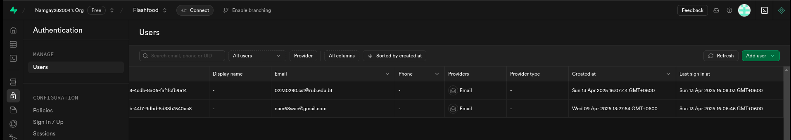

# Report on Implementing Supabase Auth in React Native Applications

## 1. Introduction

Supabase provides a robust authentication system that can be easily integrated into React Native applications. This report covers the implementation of various authentication methods, including Email & Password Login, Magic Links (Passwordless Login), Phone Login (OTP via SMS/WhatsApp), and Social Login (OAuth).

## 2. Setting Up Supabase Auth in React Native

### 2.1 Project Initialization
To begin, we created a new React Native project using Expo:

```
npx create-expo-app -t expo-template-blank-typescript expo-user-management
cd expo-user-management
```

### 2.2 Installing Dependencies

The required dependencies for Supabase integration:
```
npx expo install @supabase/supabase-js @react-native-async-storage/async-storage @rneui/themed
```

### 2.3 Configuring Supabase Client
A helper file was created to initialize the Supabase client using the API URL and anon key (safe to expose due to Row Level Security).

## 3. Authentication Methods
### 3.1 Email & Password Login
- Users can sign in using their email and password.

    
    
    

- A login component was implemented to handle:

    - User registration

    - Login validation

    - Session management

### 3.2 Magic Link (Passwordless Login)
- Users receive a one-time login link via email.

    

    

- Advantages:

    - No password required, improving security.

    - Reduces password-related support issues.

- Configuration:

    - Site URL and redirect URLs must be set in Supabase Auth settings.

    - Magic links expire after 1 hour and can only be requested once every 60 seconds.

### 3.3 Phone Login (OTP via SMS/WhatsApp)
- Users authenticate via a One-Time Password (OTP) sent via SMS or WhatsApp.

- Implementation Options:

    - Twilio Verify (Recommended for OTP)

    - Twilio Programmable Messaging (Generic SMS)

- Twilio Verify Setup:

    1. Create a Verification Service in Twilio.

    2. Configure Service ID in Supabase.

    3. OTPs are generated by Twilio (expiry and message content are managed in Twilio).

### 3.4 Social Login (OAuth)
- Users log in using Google, GitHub, etc..

- Benefits:

    - Improved UX: Faster sign-up using existing accounts.

    - Better Engagement: Access to user data (e.g., interests, demographics).

    - Enhanced Security: Leverages OAuth protocols for secure authentication.

## 4. Conclusion
Supabase Auth offers a flexible and secure way to implement authentication in React Native apps. Key takeaways:

- Email & Password: Traditional but effective.

- Magic Links: Passwordless convenience.

- Phone OTP: Secure SMS-based login.

- Social Login: Improved UX with OAuth.

- Twilio Integration: Best for SMS authentication.

By leveraging these methods, developers can create secure, user-friendly authentication flows while minimizing password-related risks.