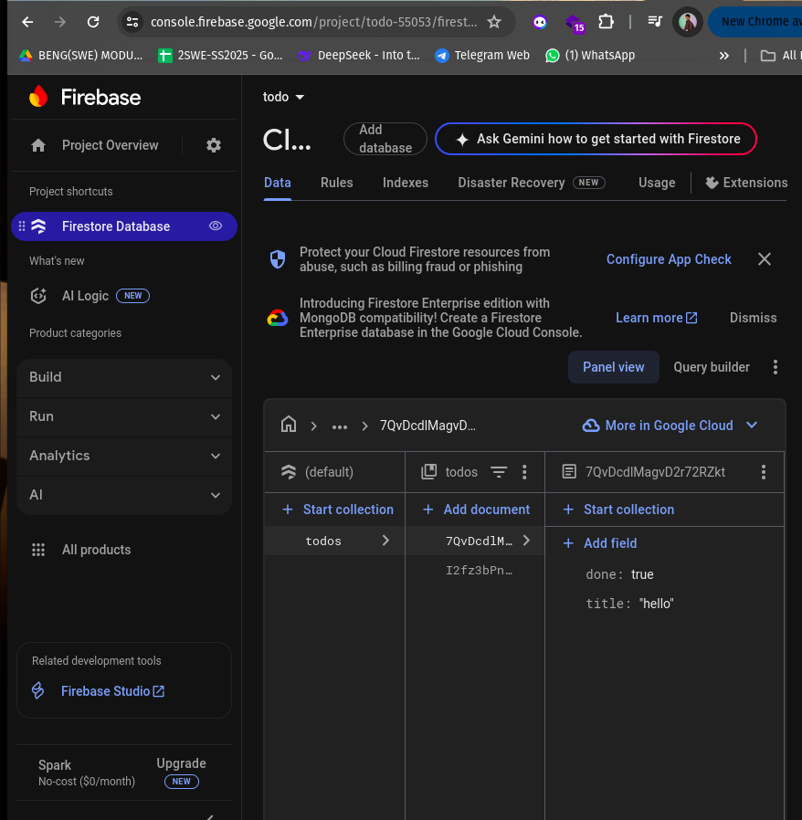
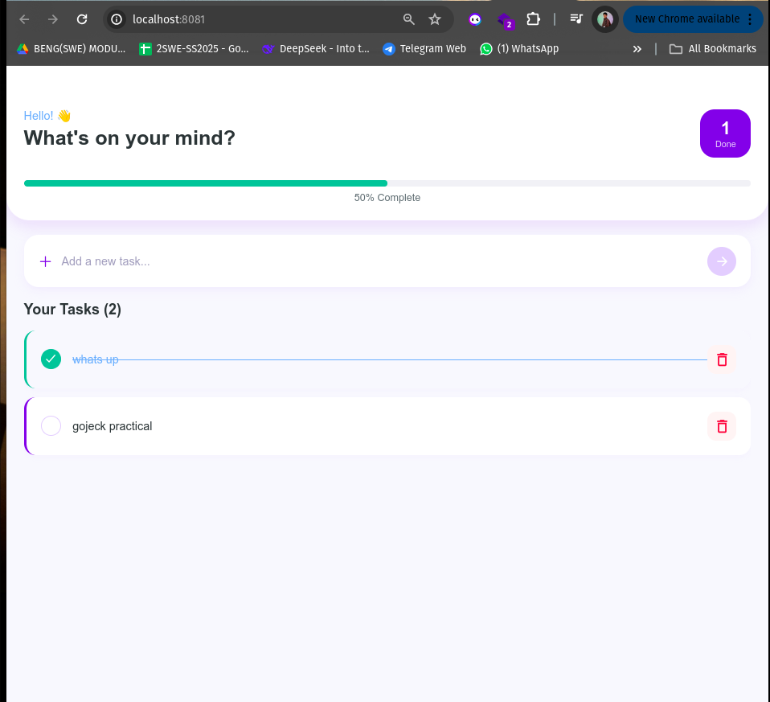

# To-Do App with Firebase

This is a simple To-Do List application built as part of a class practical. The app demonstrates the use of a monolithic architecture with separate layers for presentation, business logic, service, persistence, and database.

The application supports full CRUD functionality and uses Firebase for authentication and data persistence. All actions are protected using user token verification.

## Features

- User authentication using Firebase
- Create Task: Add a new task with a due date
- Read Task: View all tasks and task details
- Update Task: Edit an existing task
- Delete Task: Remove a task
- Data persistence using Firebase (Firestore or Realtime Database)
- Token verification to protect all CRUD operations

## Architecture

- Presentation Layer: User interface components
- Business Logic Layer: Handles application logic
- Service Layer: Connects the frontend to Firebase
- Persistence Layer: Manages interactions with Firebase
- Database Layer: Firebase Firestore or Realtime Database

## Actor

- User

## Use Cases

- Create Task: User can create a task and set a due date
- Read Task: User can view a list of all tasks and task details
- Update Task: User can update the task information
- Delete Task: User can delete a task

## Screenshots

## Setup Instructions

1. Clone the repository
2. Run `npm install` or `yarn`
3. Set up Firebase project and add configuration to the project
4. Run the app with `npm start`, `yarn start`, or `expo start` depending on your setup
